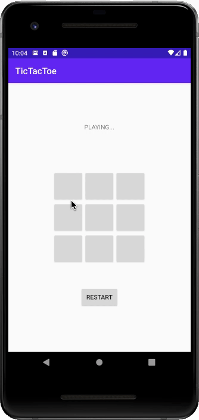

# Wafflestudio Android Seminar 1 - Assignment
#### due: 2021.09.11 11:30

## 과제 목표
- View Binding의 개념을 이해하고 사용할 수 있다.
- ViewModel의 개념을 이해한다.
    - ViewModel의 Lifecycle을 이해하고 데이터를 안전하게 저장하는 방식을 이해한다.
    - View(Activity)와 ViewModel의 분리를 통해 가질 수 있는 장점을 알고, UI 로직과 비즈니스 로직을 각각 View(Activity)와 ViewModel에 분리시킨다.
- LiveData의 개념을 이해하고 사용할 수 있다.
    - data가 변화시키고 그 변화를 observe할 수 있다.

## 과제 상세
- TicTacToe 게임을 Android Application 으로 구현한다.
- 사용자는 게임을 번갈아가며 진행하며 승리조건에 맞게 `PLAYING...`, `PLAYER X WIN!`, `PLAYER O WIN!`, `DRAW!` 등의 메세지를 구현하는 게임을 만들면 된다.
- 과제의 채점은 pass / fail 로 구체적인 기준은 두지 않고, 앞서 언급된 TicTacToe 게임의 규칙을 준수하는 앱을 만들면 된다.
- 다만 Activity에는 binding과 viewModel 이외의 변수는 선언해서는 안되며, 게임 진행 상황 메세지, 버튼의 상태 등은 ViewModel에 LiveData로 담아두고, 이를 observe하는 형식으로 코드를 작성한다.

- 버튼 디자인에 신경을 쓴다면...
    - 버튼 색은 #D7D7D7이다.
    - 버튼 배경색을 변경하고 싶으면 xml에서 backgroundTint을 건드려본다.
    - 버튼이 자기 마음대로 빈 부분을 만든다 싶으면 xml에서 insetBottom, insetTop, insetLeft, insetRight를 건드려본다.

## 제출 방식
- 본인의 github에 생성했던 `waffle-android-assign` repository를 그대로 사용한다. 
- 기존에 사용하던 로컬 깃에서 `git breakout -b assignment1` 등으로 새로운 branch로 이동한다.
- Android Studio를 통해 waffle-android-assign 폴더 안에 Assignment1 라는 이름의 새로운 프로젝트를 만든다.
- 과제를 완료한 후 `git add .`, `git commit`, `git push origin assignment1`를 통해 github에 업로드한 뒤, main(master) branch로 Pull Request를 만든다.
- 생성된 Pull Request에 [@veldic](https://github.com/veldic)을 Reviewers로 등록한다.

- 마감 시점의 assignment1 branch를 기준으로 세미나장이 직접 확인할 것입니다.
